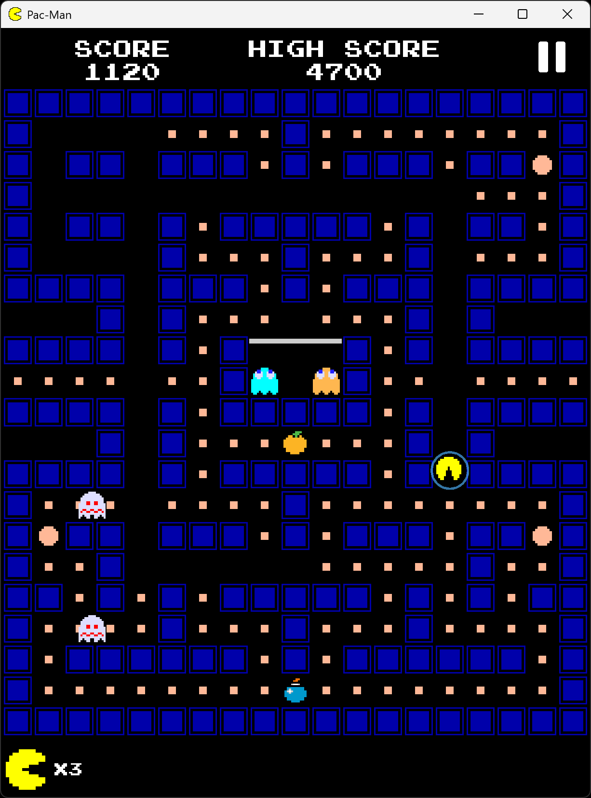
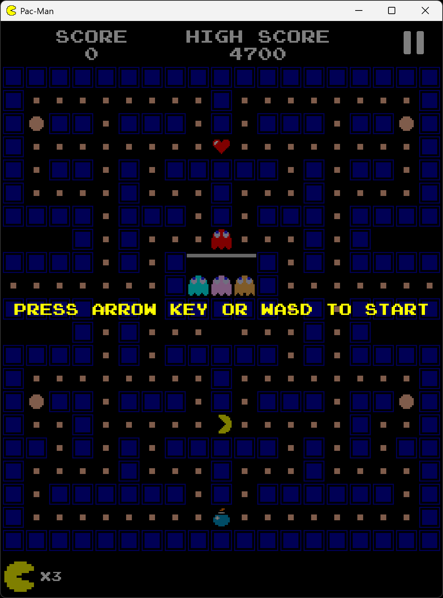
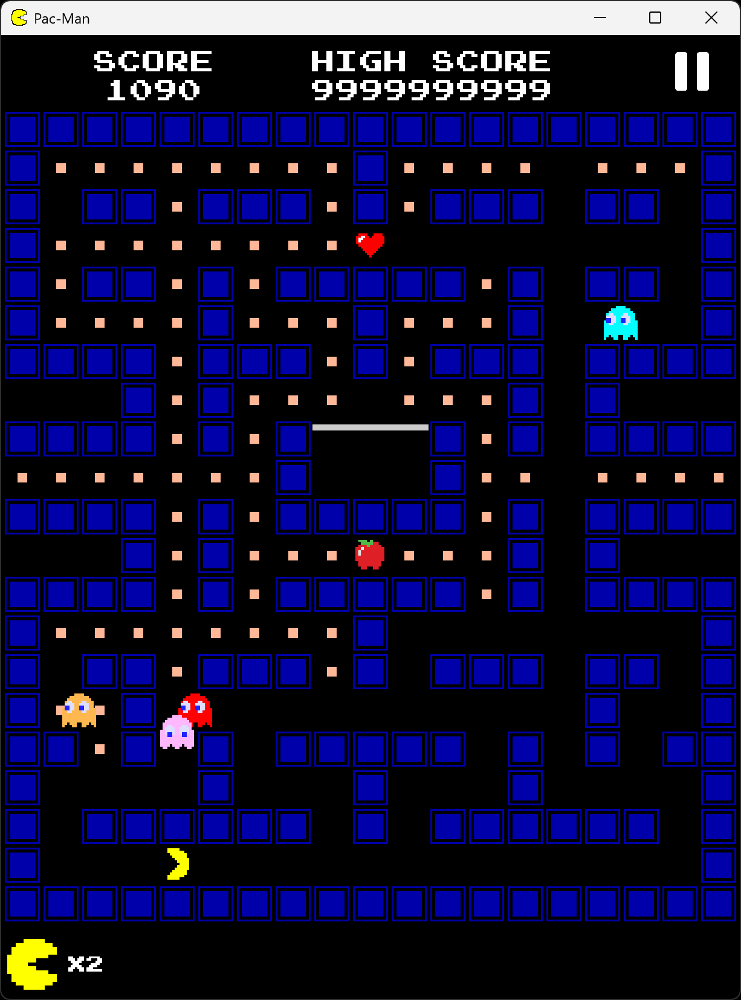
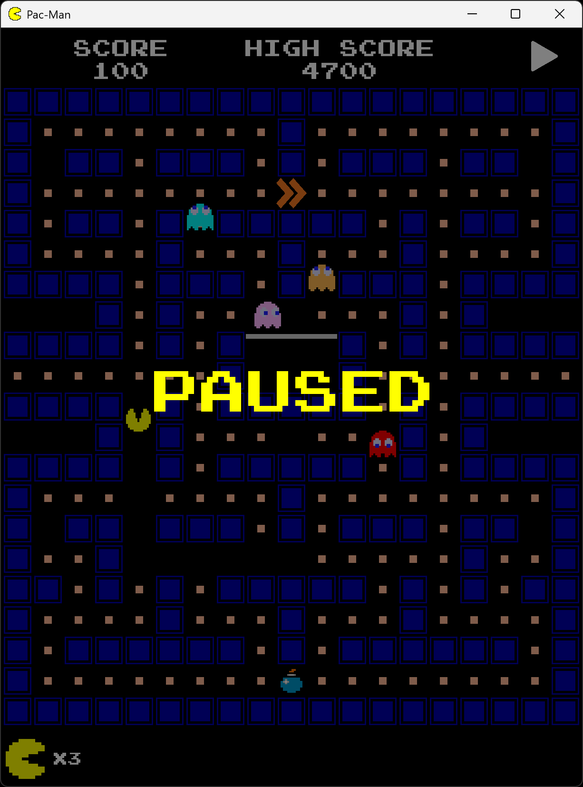
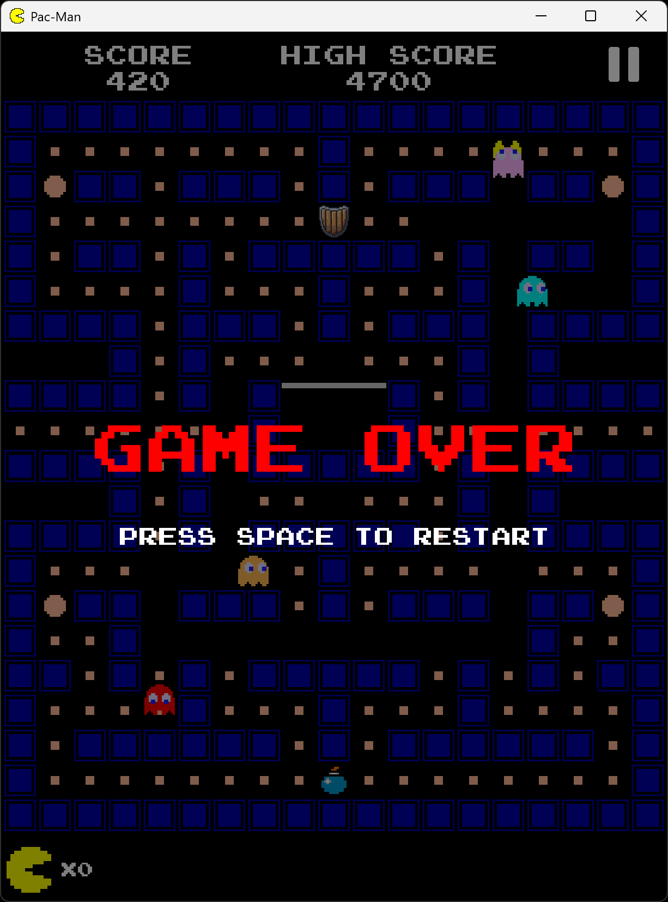

# 🕹️ Pac-Man

A simple clone of the classic arcade game Pac-Man with custom gameplay mechanics.

## 📸 Screenshots

<p align="center">
  
</p>

<table>
  <tr>
    <td></td>
    <td></td>
  </tr>
  <tr>
    <td></td>
    <td></td>
  </tr>
</table>

## 🛠️ Build from Source

To run it locally, first make sure you have:
- [Java 21+](https://www.oracle.com/java/technologies/javase/jdk21-archive-downloads.html)
- [Maven 3.9+](https://maven.apache.org/download.cgi)

After that, you can clone the repository with:
```powershell
git clone https://github.com/Arsenicum333/Pac-Man.git
```

Then, run the following commands:
```powershell
cd Pac-Man/pacman
mvn compile
mvn exec:java
```
And just like that, the game works. Pretty simple, isn't it?

You can also build a JAR file if you don't want to run Maven commands every time:
```powershell
mvn clean package -DskipTests
java -jar target/pacman-<version>.jar
```
Replace <version> with the version specified in `pom.xml`.

Once built, you can simply run the generated JAR file whenever you want.

## 📦 Pre-built JAR

But what if you don't want to run some random commands in the terminal and install Maven?

Then I have a simpler solution for you. Just make sure you have [Java 21+](https://www.oracle.com/java/technologies/javase/jdk21-archive-downloads.html) installed, and you can easily download the JAR file from the [Releases](https://github.com/Arsenicum333/Pac-Man/releases) section. Then just run it.

Unfortunately, you need to install Java on your own, because I was too lazy to make an `.exe`, `.msi`, or other platform-specific installer.

## 🎯 Point of the Game

If you somehow don't know how Pac-Man works, the goal is pretty simple:

**Collect as many points as possible while avoiding collisions with the Ghosts.**

Try not to die. That's generally considered a good strategy.

## ✨ Custom Features

After a very long brainstorming session, it was decided that the game absolutely needed some new items
(and definitely not because I didn't want to write AI for the Ghosts):
* ❤️ **Heart** - increases Pac-Man's lives by 1
* 🛡️ **Shield** - makes Pac-Man invulnerable for 10 seconds
* ⏩ **Speed Boost** - increases Pac-Man's speed for 10 seconds
* 💣 **Bomb** - decreases Pac-Man's lives by 1

## 🎮 How to control Pac-Man (Life)

| Key | Action |
| --- | --- |
| Arrow keys / WASD | Move Pac-Man |
| P / Esc | Pause or resume the game |
| Space | Restart after Game Over |

## 🏆 Scoring

| Object | Points |
| :--- | ---: |
| Dot | 10 |
| Power Pellet | 50 |
| Cherry | 200 |
| Strawberry | 400 |
| Orange | 600 |
| Apple | 800 |
| Melon | 1000 |
| Ghosts during Power Pellet effect | 200, 400, 800, then 1600 |

Ghost points reset when the frightened mode ends.

## 🤝 Contributing

Found a bug? Feel free to fix it.

I'm not against anyone making the game better, so if you find something broken and know how to fix it, go ahead and open a pull request.
